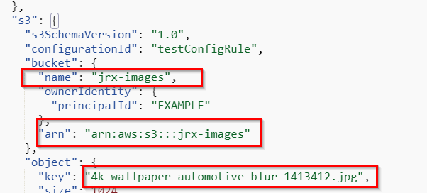

# Steps in Spanish
# CreateThumbnail: Creando un thumbnail desde imágenes subidas a S3

## Crear Execution Role
1.	Abrir la pagina de Roles (https://console.aws.amazon.com/iam/home#/roles)
2.	Crear un rol con las siguientes propiedades:
    - Trusted entity: `AWS Lambda`.
    - Permissions: `AWSLambdaExecute`.
    - Role name: `lambda-s3-role`

## Crear un Bucket en S3 y subir imagen
1.	Abrir la consola de S3 (https://console.aws.amazon.com/s3/home?region=us-east-1)
2.	Crear dos buckets con las opciones por defecto:
    - en uno se van a cargar las imágenes originales
    - otro es el resultado de la transformación (resize) del lambda.
3.	Subir un archivo en la carpeta origen (a)

## Crear la Función Lambda
1.	Crear un directorio local llamado create-thumbnail-lambda
2.	Abrir la consola o terminal dentro del directorio
3.	Ejecutar comando npm init
4.	Crear archivo index.js con el código: [index.js](https://github.com/jriverox/create-thumbnail-lambda/blob/master/index.js)
5.	Ejecutar el siguiente comando para instalar los paquetes necesarios:
    - `npm install --arch=x64 --platform=linux --target=10.15.0 sharp`
6.	Crear un archivo .zip con todo el contenido del directorio (desde dentro del directorio)
7.	Abrir la consola de lambda https://console.aws.amazon.com/lambda/home?region=us-east-1#/functions
8.	Crear una nueva función
9.	Seleccionar Author from scratch
10.	Runtime: `Node.js 10.x`
11.	Expandir Choose or create an execution role
12.	Seleccionar Use an existing role
13.	En la lista seleccionar el role `create-thumbnail-lambda-role`  creado en la sección Crear Execution Role
14.	Hacer clic en Create function
15.	En la sección Function code en la lista Code entry type seleccionar Upload a .zip file
16.	Clic botón Upload y seleccionar el .zip creado en el paso 6
17.	En la sección Basic settings, aumentar el valor de timeout a 30 segundos
18.	En la sección Environment variables agregar una variable `DESTINY_BUCKET` con el nombre del bucket destino.
19.	Clic en Save para guardar los cambios.

## Probar la Función
1.	Clic botón Test
2.	Seleccionar opción Create new test event
3.	En la lista de Event template seleccionar Amazon S3 Put
4.	Se deberá modificar los siguientes valores 
    - bucket.name = nombre del bucket origen creado en la sección Crear un Bucket en S3 y subir imagen punto 2.a
    - bucket.arn: `arn:aws:s3:::xxx` (sustituir las xx con el valor del punto anterior)
    - object.key: nombre del archivo subido al bucket
5.	Guardar el evento con el nombre `CreateThumbnailTestEvent`

## Agregar Evento
1.	Clic en el botón Add trigger
2.	Elegir en la lista S3
3.	Seleccionar el bucket creado al inicio del tutorial
4.	En Evento type seleccionar All object create events
5.	Clic en botón Add

## Prueba Final
1.	Subir algunas imagenes al bucket origen
2.	Revisar el Bucket destino donde deberpian haber creado las imágenes pequeñas.
